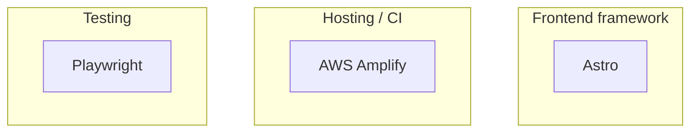

# Technology stack — System Spec

What this system is built from — frameworks, languages, tooling, and cloud services — detected from dependencies, config files, AWS SDK / CDK imports, and the SAM template.

## Stack

## Inventory

| Technology | Category | Detected from |
|---|---|---|
| Astro | Frontend framework | dep `astro` |
| AWS Amplify | Hosting / CI | `amplify.yml` |
| Playwright | Testing | dep `@playwright/test` |

## Cross-refs

- [`INDEX.md`](../INDEX.md)
